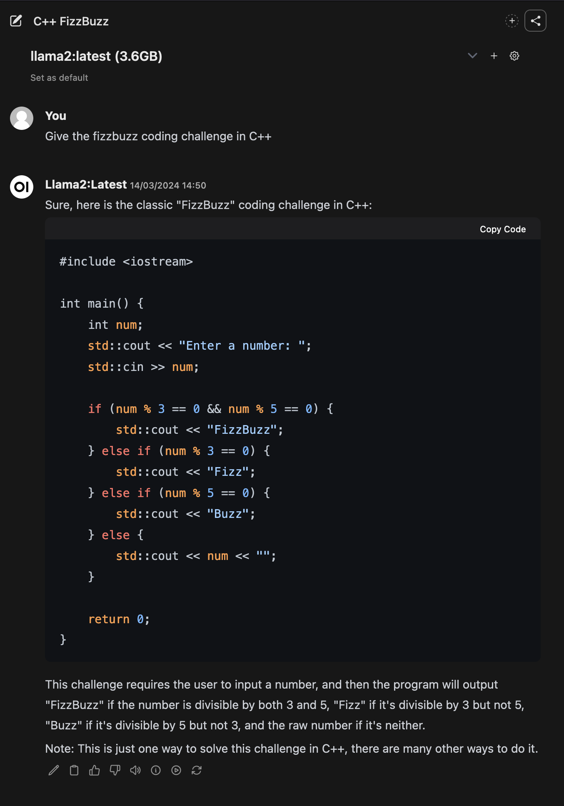
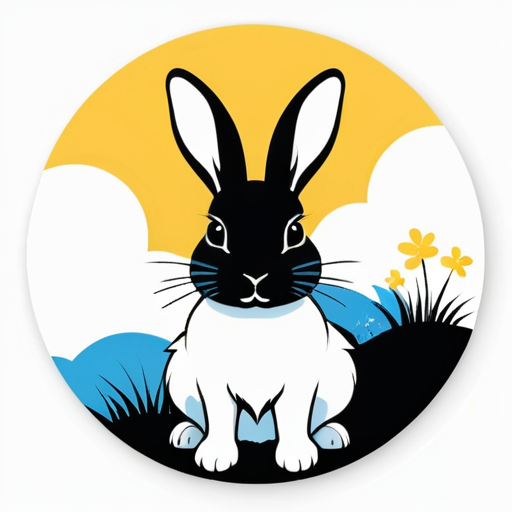
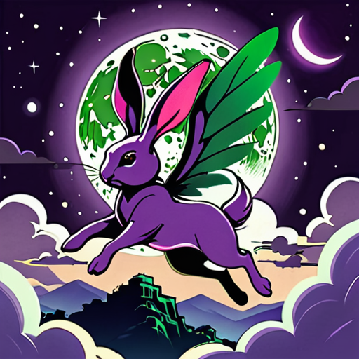

# Create your own chatbot using Ollama, open-webui and Automatic1111

We'll use the following components:

- Ollama: a chatbot that can be used via cli and its API
- open-webui: a chatgpt-like browser based GUI
- Automatic1111: an image generating AI


## Installation

Prerequisites

Have an EC2 host with a Nvidia GPU. I used a g4dn.xlarge instance
featuring a Tesla T4 GPU.

Install ollama

```
curl https://ollama.ai/install.sh | sh
```

Download the llama2 model

```
ollama run llama2
```

## Let's do the FizzBuzz coding challenge!

```
>>> give me the fizzbuzz in rust
```

```
Certainly! Here is the "FizzBuzz" program in Rust:

fn main() {
    for i in 1..=100 {
        println!("{}", if i % 3 == 0 {"Fizz"} else {"Buzz"});
    }
}

Explanation:
...
```

The result was not quite a correct solution. Let's fine tune it

```
>>> not quite! you write "fizz" for numbers that can be divided by 3,
...then "buzz" if the number can be divided by 5, otherwise the
...number itself
```

```
Ah, I see! Thank you for correcting me. Here's the updated Rust code for "FizzBuzz":

fn main() {
    for i in 1..=100 {
        println!("{}", if i % 3 == 0 {"Fizz"} else if i % 5 == 0 {"Buzz"} else {i});
    }
}
```

Almost correct, a little fix is still required

```
>>> one more thing: if the number can be divided by both 3 and 5, then print fizzbuzz
```

```
Ah, I see! Here's the updated code for "FizzBuzz" in Rust:

fn main() {
    for i in 1..=100 {
        println!("{}", if i % 3 == 0 && i % 5 == 0 {"FizzBuzz"} else if i % 3 == 0 {"Fizz"} else if i % 5 == 0 {"Buzz"} else
{i});
    }
}
```

## Install the open webui

The webui allows you to access the AI from a browser

```
docker run -d --network=host -e OLLAMA_BASE_URL=http://127.0.0.1:11434 \
    -v open-webui:/app/backend/data --name open-webui --restart always ghcr.io/open-webui/open-webui:main
```

Then we can visit http://hostname:8080/

## FizzBuzz reloaded

Now that we have the GUI installed, let's revisit the FizzBuzz challenge again in C++.
It seems that the AI has learned how to solve it, because this time it produces a flawless
solution:



## Image generation setup

Let's install Automatic1111

```
wget -q https://raw.githubusercontent.com/AUTOMATIC1111/stable-diffusion-webui/master/webui.sh
chmod +x webui.sh
./webui.sh --api --listen --port 7860
```

## Image generation prompt examples

I used the below negative prompt for all images:

```
(octane render, render, drawing, anime, bad photo, bad photography:1.3), (worst quality, low quality, blurry:1.2), (bad teeth, deformed teeth, deformed lips), (bad anatomy, bad proportions:1.1), (deformed iris, deformed pupils), (deformed eyes, bad eyes), (deformed face, ugly face, bad face), (deformed hands, bad hands, fused fingers), morbid, mutilated, mutation, disfigured
```

Some example prompts

```
circle shaped thumbnail using black, yellow and blue colors with a white rabbit inside, transparent background
```




```
dark blue sports car, front view, photorealistic, in motion, in Paris downtown, empty license plate
```


```
anime style, purple flying rabbit with green wings over the full Moon
```




## Conclusion

We have our own solution with the functionality of chatgpt and DALL-E.
Note that ollama and Automatic1111 come with a limited set of models.
However the community is strong behind them, and provides several specific
models that can extend the capabilities and the quality of their responses.

And the real power in these open source solutions is that you can also create
your very own customized model to help you with your specific tasks.

## Readme

[ollama github](https://github.com/ollama/ollama)

[ollama models](https://ollama.com/library)

[Additional models for Automatic1111](https://civitai.com/models)

[Hosting an AI chatbot with Ollama and Open WebUI](https://community.hetzner.com/tutorials/ai-chatbot-with-ollama-and-open-webui)
